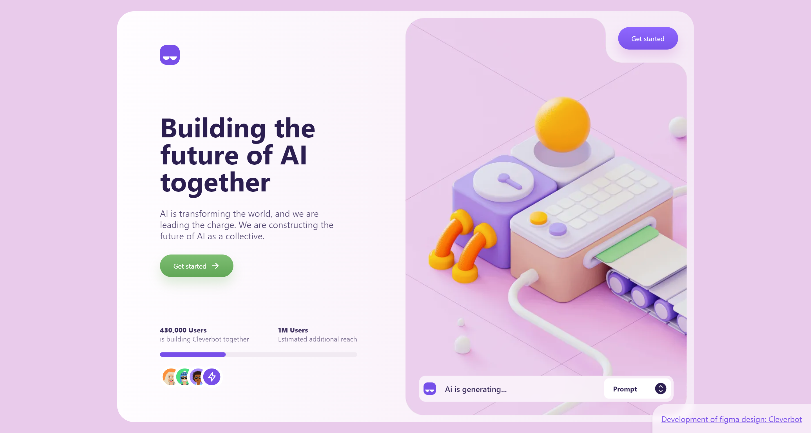

# Cleverbot

[](https://lucky-croquembouche-7e6f9b.netlify.app/)
## Description

Cleverbot is a project that implements a design concept found on Dribbble into a static page with Astro. It combines creativity and code to bring a visually appealing user interface to life.

## Features

- **Responsive Design:** The project is designed to work flawlessly on various screen sizes, from desktop to mobile.

- **Performance Metrics:**
  - **Performance:** Achieves a Lighthouse performance score of 95%.
  - **Accessibility:** Attains a Lighthouse accessibility score of 100.
  - **Best Practices:** Meets Lighthouse best practices with a score of 95.
  - **SEO:** Excels in SEO optimization, earning a Lighthouse score of 100.

## Demo

[Cleverbot](https://lucky-croquembouche-7e6f9b.netlify.app/)

## Getting Started

To run this project locally, follow these steps:

1. Clone the repository:

   ```bash
   git clone https://github.com/danpvlz/cleverbot.git

2. Enter the project

   ```bash
   cd cleverbot

3. Install dependencies

   ```bash
   pnpm install

4. Start project

   ```bash
   pnpm run dev